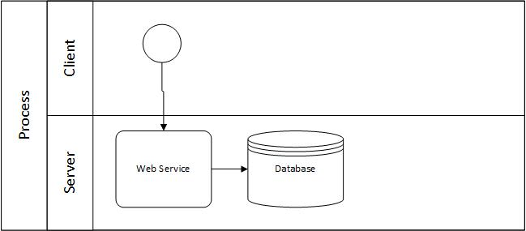
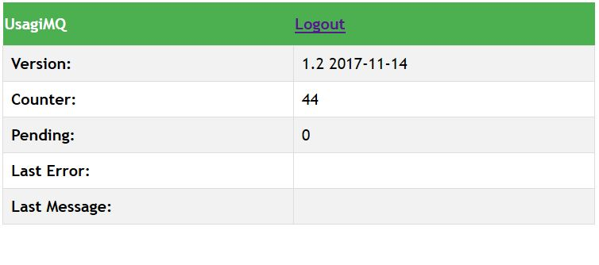

# UsagiMQ
A minimalist (less than 500 lines of code) Message Queue by using Redis and PHP in a single box (one class)


## Why I should use a Message Queue (MQ)?

Let’s say the next example, a system where one system sends information to another, for example a web client and a web service.

If the webservice is doing a **slow operation and its receiving the information of many clients** at once then, sooner or later, the system could collapses or bottleneck.

For example, if every client uses 0.1 second to do the operation (receiving the information and storing in the database), and we have 1000 customers then, every operation could take 1.6 minutes.




The solution is to add a Message Queue to the system. A Message Queue is only a server that stores messages/operations received by a PUBLISHER and later a SUBSCRIBER could execute.

For the same example, a PUBLISHER (former client) could uses 0.001 to call the MQ. Then the SUBSCRIBER could do all the operations, for example every hour/at night without worry if all the operations take many minutes or hours.


The MQ should be as fast as possible and be able to listen and store the request (envelope) of every publisher. However, the MQ is not doing the end operation, its similar to a email server.
Later, a subscriber could read this information and process as correspond.

The drawback of this method is it adds a delay, the process is not executed synchronously but asynchronously, and the PUBLISHER don't know really if the information was processed correctly by the SUBSCRIBER.

## Considerations

This library uses Redis. Redis is an open source (BSD licensed), in-memory data structure store, used as a database, cache and message broker.

## Why UsagiMQ?

While there are many Message Queue in the market (including open source / freeware / commercial) but most of them are heavyweight.
UsagiMQ is lightweight, it was developed thinking in customization. You could optimize and customize it for your needing, for example, changing the structure of envelope.

UsagiMQ lightweight:

- One class, it requires Redis and nothing more.
- < 500 lines of code.
- Easy customization.
- **It requires a single file (UsagiMQ.php)** 

## Is it scalable?

Yes, but it requires a LOAD BALANCER. 

## Envelope structure

- id = the identified of the envelope (required).  
- from = who send the envelope (optional)  
- body = the content of the envelope (required).  
- date = date when it was received. (required, generated)  
- try = number of tries. (required, for use future, generated)  


## MQ Server

Who is listening and storing the envelope (request). It should be as fast as possible.

Example:
```
include "UsagiMQ.php";
$usa=new UsagiMQ("127.0.0.1",6379,1);
if ($usa->connected) {
    $info=$usa->receive();
    if ($info=='NO INFO') {
        $usa->webUI(); // if not information is send, then it opens the UI.  It is optional
    } else {
        echo $info; // show the result.
    }
} else {
echo "not connected";
}
```

Example MQ server that calls a worker (subscriber).  See example : mqwithworker.php


### Publisher (who sends the request/envelope)

A publisher requires to send a POST to the page. So it could be a CURL, JavaScript, PHP, Java, C# and many more.

The url should be as follow:
mq.php?id=**ID**&op=**OP**&from=**FROM**

while the body (content) should be sends as POST.

- ID = is an identified of the message (required but not specifically should be unique)
- OP = the operation to do. Its some sort of folder or category.
- FROM = who is sending the message.   It could be used for authentication.


```
<?php
$ch = curl_init();

curl_setopt($ch, CURLOPT_URL,            "http://localhost/UsagiMQ/mq.php?id=200&op=INSERTCUSTOMER&from=SALESSYSTEM" );
curl_setopt($ch, CURLOPT_RETURNTRANSFER, 1 );
curl_setopt($ch, CURLOPT_POST,           1 );
curl_setopt($ch, CURLOPT_POSTFIELDS,     "** IT IS WHAT WE WANT TO SEND**" );
curl_setopt($ch, CURLOPT_HTTPHEADER,     array('Content-Type: text/plain'));

$result=curl_exec ($ch);

echo $result; // if returns OKI then the operation was successful. Otherwise, it an error.
```


## Subscriber (local)

It’s a local subscriber (has access to Redis). However, it could be used for to create a remote subscriber.

May be it could runs as a daemon / in a schedule task / or at request.

Example
```
<?php
// its a local subscriber
include "UsagiMQ.php";

$usa=new UsagiMQ("127.0.0.1",6379,1);
if (!$usa->connected) {
    echo "not connected";
    die(1);
}

$listEnveloper=$usa->listPending("insert");

foreach($listEnveloper as $id) {
    $env=$usa->readItem($id);
    var_dump($env);
    // todo: code goes here

    // $correct indicates if the operation was successful or not. For example, if the operation was to insert and the operation failed.
    // We also could decide to delete it for any case. Its up to us.
    if ($correct) {
        $usa->deleteItem($id); // YAY!
    } else {
        $usa->failedItem($id,$env); // booh hiss!.
    }
}
```

# Commands

## Constructor

> $usa=new UsagiMQ($IPREDIS,$PORT,$DATABASE);

$IPREDIS indicates the IP of where is the Redis server.
$PORT (optional) indicates the REDIS port (default value 6379)
$DATABASE (optional), indicates the database of Redis (0 is the default value)
## receive()

Receive information from the PUBLISHER.

## listPending($op)

List all keys of pending envelopers per operation.  

example:

> $array=$usa->listPending('insert');

> $array=$usa->listPending('update');


## readItem($key)

Read an item. When an item is read, its not deleted. It should be deleted once its processed.
The key could be obtained by the command listPending.

Example:
> $usa->readItem('UsagiMQ_insert:2');


## deleteItem($key)

Delete an item.   
The key could be obtained by the command listPending.  
Example:
> $usa->deleteItem('UsagiMQ_insert:2');

## failedItem($key,$arr)

We mark the item as failed. A failed item, is a item that we will try it again (until a limit). If we failed in all tries then, we will delete the item.   
- The key could be obtained by the command listPending.
- $arr is the array with the envelope [id,from,body,date,try]   
Example:
> $usa->failedItem('UsagiMQ_insert:2',array('id'=>2,'from'=>'system','body'=>'xxx','date'=>'2000-01-01','try'=>0));


## deleteAll()

Delete all items and resets the counter. 

## close()

Close Redis. Its not required to use.

## showUI()

Optional. It shows an UI with statistics. The default user and password is **admin** and you should change it.



# versions

- 2017-11-12 1.0 first version
- 2017-11-14 1.1 add new members and fixed the operation listPending. Now, its sorted.
- 2017-11-19 1.2 add UI

## Todo

- Error control / Log
- Readme missing the command
- Readme missing the PUBLISHER.

